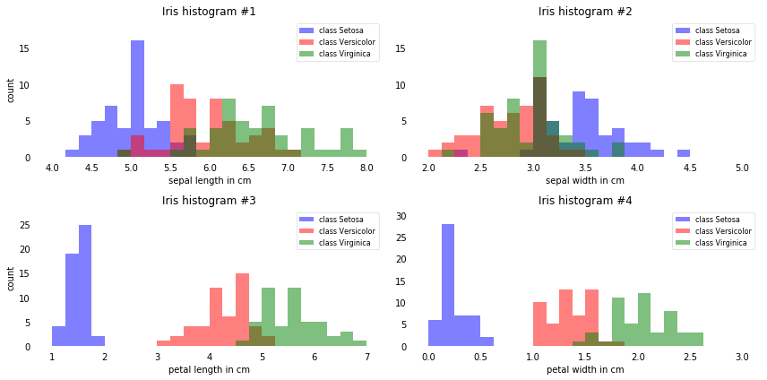
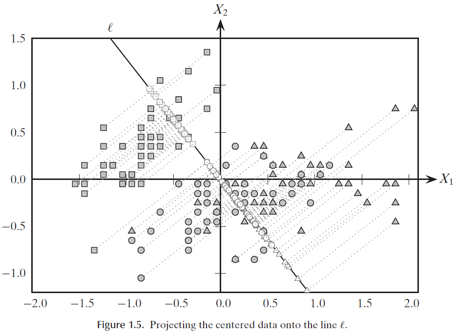
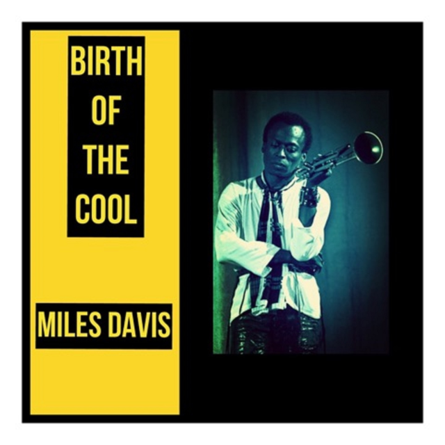

# Flower Classification

##

Two possible 'birthdates'

* John Snow and the cholera pandemic [[history here]](https://en.wikipedia.org/wiki/1854_Broad_Street_cholera_outbreak)
* Ronald Fisher the Iris dataset [[history here]](https://en.wikipedia.org/wiki/Iris_flower_data_set)

## Classifying iris flowers

[[Fisher, 1936]](https://onlinelibrary.wiley.com/doi/abs/10.1111/j.1469-1809.1936.tb02137.x)

Can flower samples be assigned to their proper sub-family purely on the basis of quantitative observation?

* Linear discriminant classification

* high-quality, annotated dataset

technique and data are intertwined!

-----

A formal description of the classification problem

-----

**Instance:**

* n datapoints, each having over d-1 numerical dimensions $\mathcal{D_1,} \dots \mathcal{D_{d-1}}$

* an expert classification function over k categories

. . .

**Solution:**

a linear combination $\mathcal{D_1} \times \mathcal{D_2} \times \dots \mathcal{D_{d-1}}\rightarrow \mathcal{D_d}$

that __respects__ the given classification.

. . .

**Measure:** *agreement* with the given classification.

## The Iris dataset

n=150 samples manually assigned by Fisher

d=5 dimensions: 4 four measurements (in cm) + the classif. 

. . .

k=3 classes: *Setosa,* *Versicolour* and *Virginica,* 50 instances each, all available from [scikit-learn](https://scikit-learn.org/stable/auto_examples/datasets/plot_iris_dataset.html)


<!-- --------------------------- -->
-----

```bash
>pip install scikit-learn
```


```python
from sklearn import datasets

iris = datasets.load_iris()

print(iris['data'])

print(iris['target'])
```

## Frequency histogram




## Canonical discriminants

A linear classifier corresponds to to a line drawn on the data display (an *axis) which creates two classification areas; more than one line is possible

. . .

find k-1 *axes* that separate the points by category

Whereas Setosa can be linearly separated, e.g., *petal_length <2* in the third column, the other two classes can't be perfectly separated.


## Fischer's discriminant

binary case: compute means and co-variance of each: $\vec{\mu_a}$,$\Sigma_a$ and $\vec{\mu_b}$/$\Sigma_b$

Define the discriminant axis with weights $\vec{w} = \frac{C}{\Sigma_a + \Sigma_b} (\vec{\mu_b} - \vec{\mu_a})$ 

his choice of weights $\vec{w}$ maximises, intuitively, variance between classes wrt. variance within each one


## Quantify agreement?

**Q:** Can we accept a linear combination that gives the correct answer only 19 times over 20?

**A:** It depends on the application.

-----

Given two putative classifiers, which is the best?

. . .

Proposed answer:

At the same level of *precision,* (fraction of cases for which the classifier agrees with the expert classification)

prefer the one that *errs* less on the clear-cut cases.

## Idea: Subset selection

ignore the less informative dimensions

## Idea: dim. reduction

Take a 2D 'scatterplot' and map it to a line: does it improve visual classification?

{width=45%}

## Idea: shrinkage

find a predictor where 

- all input dimensions are used, but 
  
- some are given less weight (possibly 0)


## Study plan

This section, with the follow-up lab experience, is self-contained.

For more background, read a PDF excerpt from the advanced [Zaki-Meira textbook](https://dataminingbook.info/), which is available from Moodle.

## A new science of data

::::{.columns}

::: {.column width="30%"}
  {width=100%}
:::

::: {.column width="70%"}

F. did not practice Stats per se as he didn't try to estimate the distribution of tiny flowers in Canada, nor did he estimate measurement errors.

Rather, he asked whether classification could become somehow __automatic__, without the need to actually *see* the flower.
:::

::::