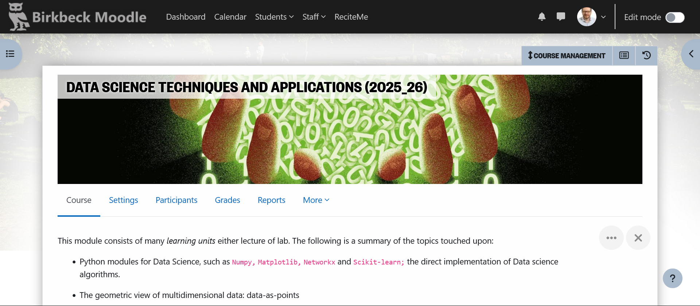
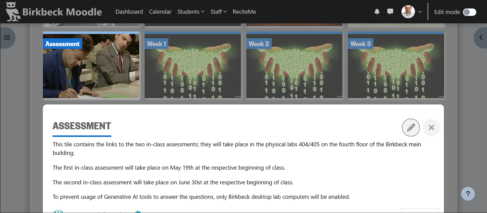

## Data Science: Techniques and Applications (DSTA)

## A new[ish] module

* Designed for MSc Data Science students

* Contents carefully dovetail with existing MSc DS modules

. . .  

#### we are in this together

<!--------------------------------------------------->
## Main topics

* Python modules for Data Science, e.g., `Numpy` 

* The geometric view of multidimensional data 

* The data-as-network view (graph algo.)

* the information-theoretic view of data, e.g., text-as-data

. . .

* a motivating DS problem: sports ranking
  
* selected topics: matrix *slicing:* finding latent dimensions to datasets.  
  
* [discontinued: handling exponentially-distributed data]

<!--------------------------------------------------->
## Important aspects

The inevitable *overfitting* to MSc DS may make this module less appealing to MSc ACT students than the title suggests

. . .

Machine Learning topics are selected so as not to overlap the essential Machine Learning and Applied ML modules.

-----

The table of contents is varied and may appear syncretic wrt. traditional, textbook-based modules..  

. . .

This is a *final* module in charge of synthetising a large, fast-moving area.

. . .

so, expect a more seminarial (than textbook) approach.

<!--------------------------------------------------->
# Organization

## In lab

* [Alessandro Provetti](https://www.bbk.ac.uk/our-staff/profile/8920719/alessandro-provetti)

* [Ying Li]()

* [Paschalis Lagias](https://www.linkedin.com/in/paschalis-lagias-ab888057)

<!-- [Alberto Matuozzo](https://www.linkedin.com/in/alberto-matuozzo-2a504a8/) -->

## Online

Standard Moodle/Teams provision

Please check your email and MyBirkbeck calendar for (unlikely) time/place amendments.

Extra: if you are familiar with the Markdown presentation language and the GitHub software repository you can sync materials as they get updated

<!---------------------------------------------------------------->
## Please see your

* PG admins, Yeti Wang or Michael Bennett, for support in navigating school: [cs-pg@bbk.ac.uk]()

 

<!---------------------------------------------------------------->
## Please see your

* TAs, Dr. Ying Li or Paschalis Lagis, for support with lab experience
  
  
  
  
<!---------------------------------------------------------------->
## and finally, see your

* module coordinator, Alessandro, about the study materials and general *'meaning of life'* questions

<!----------------------------------------------------------------->
## Too many e-mails

Your feedback and questions are always welcome.

Help avoiding [inbox overflow](https://www.theguardian.com/technology/shortcuts/2019/jan/14/inbox-infinity-is-ignoring-all-your-emails-the-secret-to-a-happy-2019) by please contacting us via MS Teams or Moodle class forum

<!--------------------------------------------------->
# Assessment

##

Each week a Moodle quiz appears in the respective Week tile.

For assessment, Moodle quizzes appear/disappear also from the Assessment tile:

## Past trends

DSTA marks in 2024-25:

|        | Min | Avg.  | Max |
|--------|-----|-------|-----|
| Cours. | 40  | 64.24 | 100 |
| Final  | 30  | 66.64 | 100 |
| Aggr.  | 36  | 66.16 | 100 |

High probability of success.

## Coursework

For the second time, coursework will take the form of an in-class, multiple-choice Moodle quiz

Please see the details under the 'Assessment' tile on Moodle.

In view of the novelty of the approach, marks will be awarded generously, but always at the discretion of the School's [Exam board](https://en.wikipedia.org/wiki/The_Spanish_Inquisition_(Monty_Python)).

<!-- ----------------------------------------------- -->
## Final test

For the second time, the final test will take the form of an in-class, multiple-choice Moodle quiz.

Please see the details under the 'Assessment' tile on Moodle.

In view of the novelty of the approach ...
