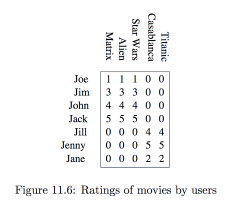
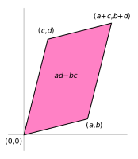
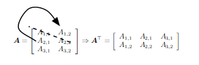

# From datasets to matrices

## Motivations

Activity tables show how users *map* their choices or, viceversa, how available products *map* onto their adopters.



<!--Essentially, a weighted binary relationship between users and films...-->

Running example from Ch. 11, p. 430 of [MMDS](http://mmds.org/).

## From tables to matrices

$$
A_{7\times 5}  =  
\begin{pmatrix}
1 & 1 & 1 & 0 & 0\\
3 & 3 & 3 & 0 & 0\\
4 & 4 & 4 & 0 & 0\\
5 & 5 & 5 & 0 & 0\\
0 & 0 & 0 & 4 & 4\\
0 & 0 & 0 & 5 & 5\\
0 & 0 & 0 & 2 & 2
\end{pmatrix}
$$

-----


$$
A_{7\times 5}  =  
\begin{pmatrix}
1 & 1 & 1 & \dots \\
3 & 3 & 3 & \dots\\
4 & 4 & 4 & \dots\\
\vdots & \vdots & \vdots & \ddots
\end{pmatrix}
$$


the matrix *'forgets'* the labels for rows/cols., eg, Joe/1st row, The Matrix/1st col. etc.


## 1-hot encodings

$$
B_{18\times 13}  =  
\begin{array}{|ccccccc|ccccc|c}
1 & 0 & 0 & {\ddots} &&& && 1 & 0 & {\ddots} && 1\\
1 & 0 & 0 & {\ddots} &&& && 0 & 1 & {\ddots} && 1\\
1 & 0 & 0 & {\ddots} &&& &&&  {\ddots} &&& {\vdots}\\
&&& {\ddots} &&& &&&  {\ddots} &&& {\vdots}
\end{array}
$$


-----

$$
B_{18\times 13}  =  
\begin{array}{|cccc|ccc|c}
1 & 0 & 0 & {\ddots} & 1 & 0 & {\ddots} & 1\\
1 & 0 & 0 & {\ddots} & 0 & 1 & {\ddots} & 1
\end{array}
$$

1st col. indicates that Joe watched the film

8th col indicates that The Matrix was the film watched

the final col. is views (or ratings) from the original table: 18 reviews overall.

-----


$$
B_{18\times 13}  =  
\begin{array}{|ccccccc|ccccc|c}
1 & 0 & 0 & {\ddots} &&& && 1 & 0 & {\ddots} && 1\\
1 & 0 & 0 & {\ddots} &&& && 0 & 1 & {\ddots} && 1\\
1 & 0 & 0 & {\ddots} &&& &&&  {\ddots} &&& {\vdots}\\
&&& {\ddots} &&& &&&  {\ddots} &&& {\vdots}
\end{array}
$$

$U \cdot F \cdot \mathbf{r}$ ( where $\cdot$ means concatenation)

# Data Science as Linear Algebra

## Linear equations

*Q:* if a user declares appreciation of Science fiction, how could it be imputed to the films they've reviewed?

. . .

A system of linear equations:

$$a_{i_1} x_1 + a_{i_2} x_2 + \dots a_{i_n} x_n = b_i$$  

. . .

$$A \mathbf{x} = \mathbf{b}$$


-----

use __r__ instead of __b__ as those are *ratings:*

$$A \mathbf{x} = \mathbf{r}$$

Interpretation: how each film contributed to determine this user's appreciation for the Sci-Fi genre


<!-- --------------------- -->
# Data Science as Geometry

## a matrix 

- represents a linear transformation, a particular type of *mapping,* between two (linear) spaces;

- is just one of the possible representations of a mapping -it depends on a choice for the bases for source and target spaces.

. . .

apply the full machinery of LA/Geometry and see what happens.


-----

apply the full machinery of LA/Geometry and see what happens.


We apply linear maps (in particular, eigenvalues and eigenvectors) to matrices that *do not represent geometric transformations,* but rather some kind of relationship between entities (e.g., users and films).


## datapoints are vectors

A user experience is represented by a vector: user's ratings for each film. E.g.,

__joe__ = <1, 1, 1, 0, 0>

__jill__ = <0, 0, 0, 4, 4>

These are *row vectors* while normally vectors are columns.
The transpose *T* operator inverts row and columns: $\mathbf{joe}^T$ is a column vector.

-----

$$
\mathbf{joe}^T =
\begin{pmatrix}
1 \\
1 \\
1 \\
0 \\
0
\end{pmatrix}
$$

$$
A =
\begin{pmatrix}
1 & 2\\
3 & 4
\end{pmatrix}
$$

. . .

$$
A^T =
\begin{pmatrix}
1 & 3\\
2 & 4
\end{pmatrix}
$$

-----

*Q:* Can the given users' experiences be combined to yield a specific point __r__ that represents a rating of how much each user likes Sci-Fi?

__r__ = $<6, 9, 10, .5, 1>^T$

. . .

## Independent vectors

Geometry sees vectors (user experiences) as axes of a reference system that *spans* a space of possible ratings.

That is possible only if at least n vectors are independent from each other.

That is automatically the case for the axes of a Cartesian diagram, or for any set of *orthogonal* vectors.

## Dependent vectors

Two vectors are dependent when one is simply a multiple of the other: their direction is the same but for *stretching* or *compression.*

Dependent v. should be detected and, if possible, excluded.

-----

Non-independence example: I only watch Jason Bourne films at my friend's

U = {Alb, Ale}, F = {The-B-id, The-B-ultimatum, ...}

$$
A_{Bourne} =
\begin{pmatrix}
4 & 4 & 4 & 0 & 2\\
2 & 2 & 2 & 0 & 1
\end{pmatrix}
$$

The two rows are dependent! Ale depends on Alb for watching Jason Bourne films.

-----

Test: can you find two numbers $x_1$ and $x_2$ s.t.

$x_1\cdot \mathbf{alb}^T + x_2\cdot \mathbf{ale}^T = \mathbf{0}$?

(here $\cdot$ means multiplication)

. . .

Simplest solution: $x_1=1$ and $x_2=-2$.

## Background: [determinant](https://en.wikipedia.org/wiki/Determinant#Applications)

The determinant understand the matrix as an area

:::: {.columns}

::: {.column width="50%"}
$$
\begin{vmatrix}
a & b \\
c & d
\end{vmatrix} = ad - bc
$$
:::

::: {.column width="50%"}

:::

::::

the new space created by taking (a,b) and (c,d) as axes

-----

if the determinant of $A$ is zero, $|A|=0$, then

* column vectors are not independent;  

* *A* does not have a unique inverse matrix, so

* __it is not amenable to further processing.__

. . .

## Matrix rank

The *Rank* of a matrix A is the dimension of the vector space generated by its columns.  
It corresponds to

1. the maximum number of linearly-independent columns  

2. the dimension of the space spanned by the rows  

We consider data matrices with independent columns, ie., $rank(A_{m\times n}) = n.$

## Matrix inversion, I

The identity matrix $I$ (or $U$) is the unit m.: $I\cdot I = I$

$$
I =
\begin{pmatrix}
1 & 0 & \dots \\
0 & 1 & \\
\vdots & & \ddots &
\end{pmatrix}
$$

. . .

```python
import numpy as np

myI = np.eye(n)
```

creates the square identity matrix of size n.

## Matrix inversion, II

Given A, find its inverse $A^{-1}$ s.t.

$A^{-1} \cdot  A = I$

. . .

:::: {.columns}

::: {.column width="50%"}
$$
A =
\begin{pmatrix}
1 & 2\\
3 & 4
\end{pmatrix}
$$
:::

::: {.column width="50%"}
$$
A^{-1} =
\begin{pmatrix}
-2 & 1\\
1.5 & -0.5
\end{pmatrix}
$$
:::

::::

A is non-singular and square: the inverse is both *left* and *right*: $A^{-1} \cdot  A = A \cdot  A^{-1} = I$

-----

In Data Science, matrices are normally rectangular and inversion is a sensitive topic:

* the inverse may not exist, or be non-unique;

* numerical issues: $A^{-1}\cdot A\approx I$.

```python
print(Ainverse.dot(A))

[[1.00000000e+00 0.00000000e+00]
 [1.11022302e-16 1.00000000e+00]]
```

-----

Inversion is only defined for square matrices:

if $A$ is rectangular then *square it:* $A^\prime = A^T\cdot A$

{width="50%"}

. . .

```python
import numpy as np

a = np.array([[11, 12], [21, 22],  [31, 32]])

at2 = a.transpose()
```

# Computing

## Numpy

Numpy extends Python to numerical computation.

To handle large data it creates view rather copies of arrays/matrices.

```python
import numpy as np

a = np.array([[11, 12], [21, 22],  [31, 32]])

# changeable array
at2 = a.transpose()

a[0][0] = 111

print(a)

print(at2)
```

-----

Alternative transposition:


```python
import numpy as np

a = np.array([[11, 12], [21, 22],  [31, 32]])

# tuples, not lists, and only once
at = zip(*a)

for row in at:
    print(row)
```

## Matrix multiplication

```python
A.dot(B) == A @ B # matrix multiplication

A.dot(B) != A * B # element-wise product
```

``@`` generalises to *tensors:* three-dimensional matrices.

-----

```python
m = np.array([[4, 4, 4, 0, 2], [2, 2, 2, 0, 1]])

mt = m.transpose()

mprime = m.dot(mt)

print(mprime.shape)
```

Here (the Jason Bourne ex.) rows are *not* independent.
This is revealed by $|M^\prime |=0$

```python
print(np.linalg.det(mprime))

0.0
```

-----

Matrix inversion and checking for errors in the results

```python
i = np.eye(2)

if (np.linalg.det(mprime)):

 mprime_inv =  np.linalg.inv(mprime)

 mprime_dot_mprime_inv = mprime.dot(mprime_inv)

 # handles inf and tiny vals
 print(np.allclose(mprime_dot_mprime_inv, i)) 
```

prints ``true`` if ``mprime_dot_mprime_inv`` is  element-wise equal to ``i`` within a [*tolerance.*](https://numpy.org/doc/stable/reference/generated/numpy.allclose.html)

<!------------------------------------------------------------->
