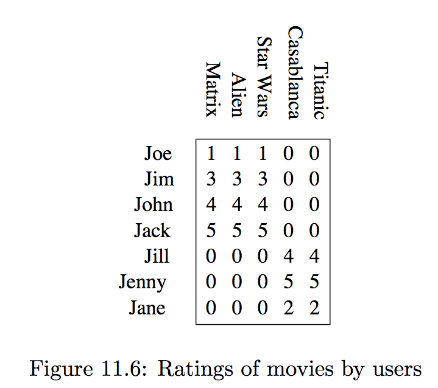
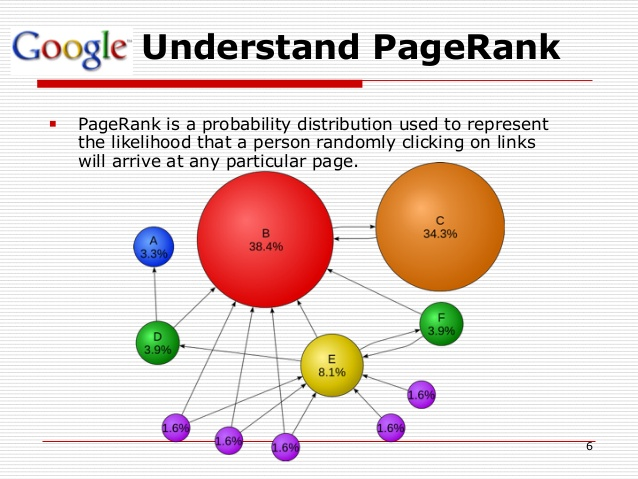

# Motivations

-----

## Motivations 

Activity tables show how users *map* their choices, 

or how available products *map* onto their adopters.

{width="20%"}

-----

{width="20%"}

Data Science view: 7 user profiles; 18 datapoints of user review.

Network science view: a weighted, binary relationship between users and films.

Let's step back and see what Geometry gives us.

-----

## Spectral Methods

Most activity matrices represent the connections between n entities (e.g., subscribers) and m entities (e.g., films) with $n<>m$.

Sometimes the connections is between the same entities, such as endorsement, teams defeating other teams, friends or followers on social networks etc.

In such cases, the matrix is *square.*

Standard Geometry holds and we can extract its *eigenpairs*.

# Matrices

-----

## Traditional view

There is a *space* in *n* dimensions

Each point is represented by an n-dimensional vector $\mathbf{x}$ (or $\vec{x}$)

*Transformation:* a *expansion* or a *contraction,* possibly combined with a *rotation,* is represented by a matrix, $A$

The resulting point is computed as $A \mathbf{x}$.

-----

## Example

$$
\mathbf{x} =
\begin{pmatrix}
1 \\
0.5 
\end{pmatrix}
$$

$$
M =
\begin{pmatrix}
1 & 2\\
3 & 4
\end{pmatrix}
$$

. . .

$$
M\mathbf{x} =
\begin{pmatrix}
2 \\
5 
\end{pmatrix}
$$

M does  anti-clockwise rotation and expansion at once.

-----

## More examples

$$
\mathbf{x} =
\begin{pmatrix}
1 \\
0.5 
\end{pmatrix}
$$

. . .

expand $\mathbf{x}$ to double its length:

$$
\begin{equation}
\begin{pmatrix} 2 & 0 \\ 0 & 2 \end{pmatrix}
\begin{pmatrix} 1 \\ 0.5 \end{pmatrix}
=
\begin{pmatrix} 2 \\ 1 \end{pmatrix}
\end{equation}
$$

-----

compress $\mathbf{x}$ to halve its length:

$$
\begin{equation}
\begin{pmatrix} 0.5 & 0 \\ 0 & 0.5 \end{pmatrix}
\begin{pmatrix} 1 \\ 0.5 \end{pmatrix}
=
\begin{pmatrix} 0.5 \\ 0.25 \end{pmatrix}
\end{equation}
$$

-----

rotate $\mathbf{x}$ anticlockwise:

$$
\begin{equation}
\begin{pmatrix} 0 & -1 \\ 1 & 0 \end{pmatrix}
\begin{pmatrix} 1 \\ 0.5 \end{pmatrix}
=
\begin{pmatrix} -0.5 \\ 1 \end{pmatrix}
\end{equation}
$$

-----

rotate $\mathbf{x}$ clockwise:

$$
\begin{equation}
\begin{pmatrix} 0 & 1 \\ -1 & 0 \end{pmatrix}
\begin{pmatrix} 1 \\ 0.5 \end{pmatrix}
=
\begin{pmatrix} 0.5 \\ -1 \end{pmatrix}
\end{equation}
$$

-----

change sense: 

$$
\begin{pmatrix} -1 & 0 \\ 0 & -1 \end{pmatrix}
\begin{pmatrix} 1 \\ 0.5 \end{pmatrix}
=
\begin{pmatrix} -1 \\ -0.5 \end{pmatrix}
$$

# Eigenpairs

-----

## Definition

If matrix $A$ has a real $\lambda$ and a vector $\mathbf{e}$ s.t.

$$A\mathbf{e} = \lambda \mathbf{e}$$

then $\lambda$ is an *eigenvalue* and $\mathbf{e}$ an *eigenvector* of A.

. . .  

If *A* has rank *n* then there could be up to *n* eigenpairs.
In practice,

* they might not be real, nor $\neq 0$, and

* are always *costly:* $n^\alpha)$ scalar multiplications, n being the size of the matrix and $\alpha \approx 2.81$.

-----

## Eigendecomposition

The *effect* of A can be decomposed into translation + rotation thanks to the extraction of *eigenpairs* $\langle \lambda, \mathbf{e} \rangle$:

$$
A\mathbf{e} = \lambda \mathbf{e}
$$

. . .

Consider the M matrix again:

$$
M =
\begin{pmatrix}
1 & 2\\
3 & 4
\end{pmatrix}
$$

-----

$$
M =
\begin{pmatrix}
1 & 2\\
3 & 4
\end{pmatrix}
$$

solve $M\mathbf{e} = \lambda\mathbf{e}$ to find

$\lambda_1 \approx 5.372$ and $\lambda_2 \approx -0.372$.

-----

$\lambda_1 \approx 5.372$ and $\lambda_2 \approx -0.372$.

$$
\mathbf{e_1} \approx
\begin{pmatrix}
0.416 \\
0.909 
\end{pmatrix}
$$

$$
\mathbf{e_2} \approx
\begin{pmatrix}
0.824 \\
-0.0566 
\end{pmatrix}
$$

M now can be re-defined as the product of simpler operations:

-----

$$
M = Q\Lambda Q^{-1}
$$

Stretching, followed by rotation followed by 'stretching back'

$$
Q =
\begin{pmatrix}
\mathbf{e_1} & \mathbf{e_2}
\end{pmatrix}
$$

$$
\Lambda = 
\begin{pmatrix}
\lambda_1 & 0\\
0 & \lambda_2
\end{pmatrix}
$$

-----

## Finally

$$
\begin{pmatrix}
1 & 2\\
3 & 4
\end{pmatrix}
 =
$$

$$
\begin{pmatrix}
0.416 & 0.824\\
0.909 & -0.566 
\end{pmatrix}
\begin{pmatrix}
5.372 & 0 \\
0 & -0.372 
\end{pmatrix}
\begin{pmatrix}
0.575 & 0.837\\
0.924 & -0.423 
\end{pmatrix}
$$

-----

## Example application

$$M\mathbf{x}\, =
\begin{pmatrix}
1 & 2\\
3 & 4
\end{pmatrix}
\begin{pmatrix}
1 \\
0.5 
\end{pmatrix}
$$

$$
\begin{pmatrix}
0.416 & 0.824\\
0.909 & -0.566 
\end{pmatrix}
\begin{pmatrix}
5.372 & 0 \\
0 & -0.372 
\end{pmatrix}
\begin{pmatrix}
0.575 & 0.837\\
0.924 & -0.423 
\end{pmatrix}
\begin{pmatrix}
1 \\
0.5 
\end{pmatrix}
$$

-----

$$
M\mathbf{x} =
\begin{pmatrix}
0.416 & 0.824\\
0.909 & -0.566 
\end{pmatrix}
\begin{pmatrix}
5.372 & 0 \\
0 & -0.372 
\end{pmatrix}
\begin{pmatrix}
0.994 \\
0.712
\end{pmatrix}
$$

-----

$$
M\mathbf{x} =
\begin{pmatrix}
0.416 & 0.824\\
0.909 & -0.566 
\end{pmatrix}
\begin{pmatrix}
5.340 \\
-0.265
\end{pmatrix}
$$

-----

$$
M\mathbf{x} =
\begin{pmatrix}
2.003 \\
5.004
\end{pmatrix}
$$

-----

## Interesting square matrices

*A* is called *symmetric* when $A=A^T$

Example matrix M is not symmetric:

$$
M =
\begin{pmatrix}
1 & 2\\
3 & 4
\end{pmatrix}
\neq
\begin{pmatrix}
1 & 3\\
2 & 4
\end{pmatrix}
= M^T
$$

-----

*A* is called *positive semidefinite* when, for any $\mathbf{x}$, we have

$$\mathbf{x}^T A \mathbf{x} \ge 0$$

In such case its eigenvalues are guaranteed non-negative: $\lambda_i\ge 0$,

this helps interpretation of activity matrices.

-----

## Singular Value Decomposition

For rectangular matrices Eigendecomposition is not defined.

SVD will provide a similar decomposition for data matrices of any size.

Details are in the [Goodfellow et al.] textbook and will be introduced later on.

# Applications

-----

## Spectral properties

Adjacency matrices represent connections between entities in a network (graph), e,g., the Web.

The eigenvalues of adjacency matrices provide bounds for several network features.

Google PageRank algorithm *is* spectral network anal.

{width="20%"}

-----

Web page importance $\approx$ eigenvector centrality:

{width="60%"}

Early applications in Psychology, Social science, Bibliometrics, Economics, and Choice theory (seriously).

-----

## Spectral ranking

Given a matrix representing preference or likeability between people, can we rank the participants (from best to worst) on the basis of their general, intrinsic likeability?

. . .

[[Seely, 1949]](https://psycnet.apa.org/doi/10.1037/h0084096) created an index of likeability based on the ideas of *diffusion:* it is important to be liked by people who in turn are well-liked and so on.

Let $M$ be a square matrix where $m_{ij}$ represents *approval* or *endorsement* (negative values represent *disapproval)*

. . .  

my *likeability index* should be equal to the weighted sum of of the indices of the people who like me.  

-----

my *likeability index* should be equal to the weighted sum of of the indices of the people who like me.  

But their likeability is turn will depend on mine...

Let's use row vectors $\mathbf{r} = [ r_1, r_2, \dots r_n]$:

$$\mathbf{r} = \mathbf{r} M$$

i.e., $\mathbf{r}$ is a left eigenvector of M.

This formula might have no solution, but matrix preprocessing can assure that one exists.

# Study plan

-----

## Background study

Ian Goodfellow, Yoshua Bengio and Aaron Courville:
[Deep Learning, MIT Press, 2016](https://www.deeplearningbook.org/).

available in HTML and PDF;
it is *a refresher* of notation and properties: no examples and no exercises.

It can be read in the background.

* Phase 1: read &sect;&sect; 2.1---2.7, then &sect; 2.11.

* Phase 2: read &sect;&sect; 2.8---2.10

