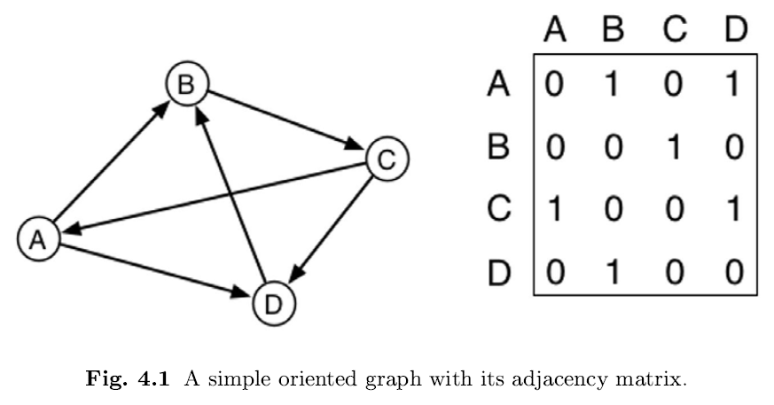
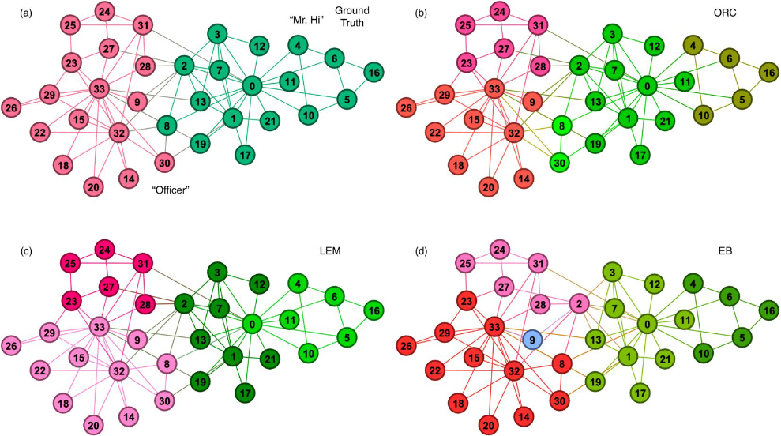
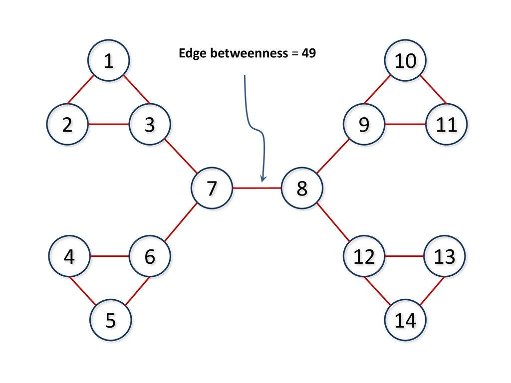

## Networks of Humans

Theme: no one controls the evolution of the network, which is self-organizing

What is represented (self, news, opinion, concept) and its __lifecycle__ determines the structure and the research questions

. . .

look at how they connect and when

Direction of communication is important

```python
import networkx as nx 

eu_DG = nx.DiGraph()
```

<!-- ------ -->
# Getting data

## WWW

- a Networkx *digraph* will represent connectivity

- a companion dictionary maps vertices to URLs of the relative pages

- source: a *scrape* of the 2005 ".eu" domain

## X/Twitter

- today supported by the Python [Tweepy](https://www.tweepy.org/) module

- mentions create a network and a *a voting system.*


## Wikipedia

- a network of concepts (lemmas/lemmata) maintained by humans (and some bot)

- time-stamped evolution of the network is available [[dumps.wikimedia.org]](https://dumps.wikimedia.org/)

- contrary to *curated* taxonomies, e.g., [Linnaeus, 1735], this is not a tree

. . .

 a __directed acyclic graph__ is the reference model

<!-- --------------------- -->
# Ranking Algorithms: PageRank

## PageRank idea

Rank vertices (page) on the basis of their *importance* for network *navigation*

Importance is captured by the relative value in the dominant Eigenvector of a new matrix, P for 'Page,' that represents *navigation*

Navigation includes a certain prob. of frustration and restart: modeled as a small, uniform prob. to *jump out* to a random node.





## PageRank as Matrix operations

$A:$ the directed adjacency matrix of web pages

- it admits *dangling* (or *sink*) pages that link nowhere

- Brin/Page drop internal links 

. . .

$K_0:$ has the out-degree of each node on the main diagonal.

$k^{out}_i = \sum_j A_{ij}$.

$K_0 = \operatorname{diag}(k^{out}_0, k^{out}_1, \ldots, k^{out}_{n-1}).$

. . .


$K_0^{-1}$ will have $\frac{1}{k^{out}_i}$ on the main diagonal, 0 elsewhere

-----

## The normalised matrix

$N = K_0^{-1} A$ 

- similar to A

- all rows sum to 1: they represent the prob. of transitioning ('surfing').


-----

## The escape matrix

$E = \frac{1}{n} \mathbf{1} \mathbf{1}^T$

- $\frac{1}{n}$ everywhere, $n = |V|;$
  
  
- rows still sum to 1.

- it forces *irreducibility* (see Perron-Frobenius): any two pages are certainly connected

- (current versions may put different values on the main diagonal)


-----

## The Page matrix

$$P = \alpha N + (1-\alpha) E$$

Page and Brin empirically set $\alpha=0.85$

$1-\alpha=0.15:$ probability of *jumping out* of a navigation *path* and into an arbitrary *restart* node.

Compute the dominant eigenvector $\mathbf{r}_1$ of $P.$

. . .

Perron-Frobenius applies so $\mathbf{r}_1$ will be a 'proper' vector of real, positive values.

Compute $\mathbf{r}_1$ by the power method seen earlier:

- iterate the $\mathbf{r}_1^{(t+1)} = P\mathbf{r}_1^{(t)}$ followed by normalisation; 

- until it converges to a fixpoint value.


# Ranking Algorithms: HITS

## HITS idea

Hyperlink-Induced Topic Search by [[Kleinberg, 1999]](https://dl.acm.org/doi/10.1145/324133.324140)

Sees importance of a node in a more nuanced way:

Pages that are important for consultation, e.g., train schedules, have *authority* and tend to be *terminal*

. . .

Well-connected *hub* pages that facilitate navigation, e.g., Time Out, are useful but not authoritative per se

. . .

1. authority score $\mathbf{au(i)}$

2. hub score $\mathbf{h(i)}$

## HITS as Mutual recursion

Hub-iness influences authority which in turns influences hub-iness:

$$au(i) \propto \sum_{j\rightarrow i} h(j)$$

page *i* is authoritative proportionally to the sum of the hub-iness of the pages that link to it.

-----

$$h(i) \propto \sum_{i\rightarrow j} au(j)$$

page *i* is hub proportionally to the sum of the authoritativeness of pages that it links to.

## Computing HITS scores

We could start with assigning 1 everywhere and hoping that mutual recursion will converge to stable *au* and *h* values.

As with Von Mises' method, we normalise vectors to 1 at each iteration.

## Linear Algebra derivations

$$\mathbf{h} \propto AA^T \mathbf{h} = \lambda_h AA^T \mathbf{h}$$

$$\mathbf{au} \propto A^TA \mathbf{au} = \lambda_{au} A^TA \mathbf{au}$$

I.e., we can find $\mathbf{h}$ and $\mathbf{au}$ separately by solving the eigenvalue problem for the matrices $AA^T$ and $A^TA$

## Main result

For *primitive* matrices (i.e., connected networks, no dead-ends/sinks)


$$\mathbf{h} \propto AA^T \mathbf{h} = \lambda_h AA^T \mathbf{h}$$

$$\mathbf{au} \propto A^TA \mathbf{au} = \lambda_{au} A^TA \mathbf{au}$$

- convergence is assured;

- dominant $\lambda$ is unique and

- values for $\mathbf{h}$ and $\mathbf{au}$ will be all positive, as desired.

(negative values have no interpretation here)

<!-- ------------------ -->
# Community detection

## Finding social structures

this is an example of Provost-Fawcett's problems

- 4: Clustering

- 5: co-occurrence grouping

. . .

For homogeneous networks, eg., country-to-county of Ch. 2

Community: nodes that are closely connected with each other by *strength* or *density*

Resolution limit: communities with less than $\sqrt{|V|}$ members cannot be properly identified.

-----

## Karate club examples




Ground truth vs. community detection in [[Sia et al., Sc. Rep. 2019]](https://www.nature.com/articles/s41598-019-46079-x)


## Girvan-Newman

Hyp: Betweenness centrality captures *help to connectivity*

but removing betwenness we reveal the actual underlying community structure

1. Rank edges by their *help to connectivity*

2. remove the top-ranking edge

3. repeat until loss of connection

4. now-isolated areas are called communities




# Modularity

## As an optimization prob.

__Instance:__ an adj. matrix A, a small integer $g$

__Solution:__ a partition of $V$ into $g$ *groups*

. . .

__Measure:__ maximise $Q$: the overall modularity measure

Interpretation: how likely is a random walker to leave the community?


## The Q factor

Let $E_{g \times g}$ be the cross-group matrix and $f_i$ the sum of col. $i.$

. . .

Electrical conductance:

$$Q =\sum_{i=1}^g e_{ii}-f_i^2$$

. . .

Complexity: NP-complete: it won't scale up

Even random networks might exhibit 'densifications' that might look as communities.
